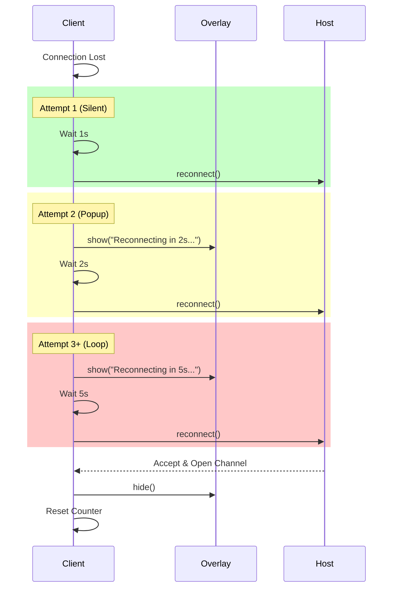

# Work Summary

Implemented a robust client-side reconnection strategy to handle network instability or host restarts. The system now uses a progressive backoff approach: a silent retry after 1s, followed by a visible popup and retry after 2s, and then a 5s retry loop. This ensures minor glitches are handled seamlessly while keeping the user informed during longer outages.

Key achievements:
- **Connection Overlay**: Created a dedicated UI component for connection warnings.
- **Progressive Reconnection**: Implemented smart retry logic (1s silent -> 2s popup -> 5s loop).
- **Auto-Recovery**: Clients automatically reconnect to the host without page refresh.
- **State Management**: Proper cleanup and re-initialization of WebRTC peers during reconnection.

## Commit Reference

- **Commit**: `4bb4f62fd3ab88fbe5cb2d3d722d29717acb4db5`
- **GitHub**: https://github.com/masyl/outside/commit/4bb4f62fd3ab88fbe5cb2d3d722d29717acb4db5
- **Description**: Implement progressive client reconnection strategy with UI overlay

---

# Client Connection Stability

This plan implements the reconnection logic for the game client as described in the pitch.

### 1. Create Connection Overlay
Created a new UI component `[outside-client/src/debug/connectionOverlay.ts](outside-client/src/debug/connectionOverlay.ts)` to display connection status messages.
- **Class**: `ConnectionOverlay`
- **Methods**: `show(message: string)`, `hide()`
- **Style**: Modal popup centered on screen, high z-index, warning colors.

### 2. Enhance ClientMode
Updated `[outside-client/src/network/client.ts](outside-client/src/network/client.ts)` to support manual reconnection.
- Added `reconnect()` method:
    - Close and nullify existing `hostPeer`.
    - Call `initiateConnection()`.

### 3. Implement Reconnection Loop
Updated `[outside-client/src/main.ts](outside-client/src/main.ts)` to wire up the reconnection logic.
- Instantiated `ConnectionOverlay`.
- In `initializeClientMode`, defined `handleReconnection`:
    - Tracks attempts to implement progressive strategy:
        - **Attempt 1**: 1s delay, silent (no popup).
        - **Attempt 2**: 2s delay, show popup ("Trying to reconnect...").
        - **Attempt 3+**: 5s delay, keep popup.
    - Calls `clientMode.reconnect()` after delay.
- Updated `onConnected` callback:
    - Hide overlay.
    - Reset reconnection attempt counter.
- Updated `onDisconnected` and `onConnectionStateChange` (for 'failed'/'disconnected') to call `handleReconnection`.

### Mermaid Diagram

