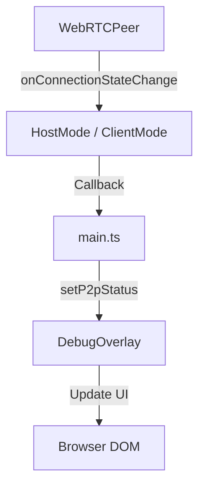

# Work Summary

Implemented a real-time P2P connection status indicator in the debug overlay. This provides immediate visibility into the state of WebRTC connections (connected, disconnected, failed, etc.) for both Host and Client modes.

Key achievements:

- **Real-time Status**: Exposed WebRTC connection state changes from `WebRTCPeer` up to the UI.
- **UI Integration**: Added a "P2P: [status]" line to the debug overlay that updates automatically.
- **Dual Mode Support**: Works for both Host (monitoring client connections) and Client (monitoring host connection).
- **Callback Architecture**: Implemented a clean callback chain from `WebRTCPeer` -> `HostMode`/`ClientMode` -> `main.ts` -> `DebugOverlay`.

## Commit Reference

- **Commit**: `b1c546912260cc42724fcb697fdf9a8ad3f58c96`
- **GitHub**: https://github.com/masyl/outside/commit/b1c546912260cc42724fcb697fdf9a8ad3f58c96
- **Description**: Add P2P status indicator to debug overlay with real-time connection state updates

---

# Add P2P Status to Debug Overlay

This plan describes how to implement a P2P connection status indicator in the debug overlay. This will help developers see the real-time status of WebRTC connections.

### 1. Update WebRTC Utilities

Modified `[outside-client/src/network/webrtc.ts](outside-client/src/network/webrtc.ts)` to expose a connection state change handler.

- Added `onConnectionStateChangeHandler` method to `WebRTCPeer` class.
- Triggered the handler inside `pc.onconnectionstatechange`.

### 2. Update Debug Overlay UI

Modified `[outside-client/src/debug/overlay.ts](outside-client/src/debug/overlay.ts)` to include a P2P status display.

- Added `p2pStatusElement` to the `DebugOverlay` container.
- Implemented `setP2pStatus(status: string)` method to update the element's text.
- Initialized with "P2P: unknown".

### 3. Update Network Modes

Updated `HostMode` and `ClientMode` to propagate connection state changes via callbacks.

- In `[outside-client/src/network/host.ts](outside-client/src/network/host.ts)`:
  - Added `onConnectionStateChange` to `HostCallbacks`.
  - Set up the handler on each new `WebRTCPeer` in `handleOffer`.
- In `[outside-client/src/network/client.ts](outside-client/src/network/client.ts)`:
  - Added `onConnectionStateChange` to `ClientCallbacks`.
  - Set up the handler on the `hostPeer` in `initiateConnection`.

### 4. Wire Up in Main

Updated `[outside-client/src/main.ts](outside-client/src/main.ts)` to connect the network callbacks to the debug overlay.

- In `initializeHostMode`, updated `debugOverlay` when clients connect/disconnect or change state.
- In `initializeClientMode`, updated `debugOverlay` when the host connection state changes.

### Mermaid Diagram of Data Flow

