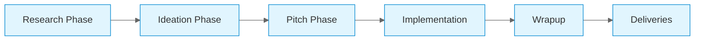

# Design Process Overview

This section documents our design process for the Outside game project.

## Our Approach

We follow a user-centered design process that emphasizes research, ideation, and iteration.

## Process Stages

### 1. Research Phase

Understanding the problem space, user needs, and constraints.

[Learn more about our research →](/design-process/research)

### 2. Ideation Phase

Generating creative concepts and exploring design possibilities.

[Learn more about ideation →](/design-process/ideation)

### 3. Pitch Phase

Framing scope of development work through structured work orders.

[Learn more about the Pitch Phase →](/design-process/pitch-phase)

## Key Principles

- **User First**: Every design decision starts with the user experience
- **Iterative**: We refine designs through multiple iterations
- **Data-Driven**: Research and testing inform our decisions
- **Collaborative**: Design is a team effort

## Tools & Methods

- User interviews and surveys
- Competitive analysis
- Wireframing and prototyping
- Usability testing
- Design sprints

---

[← Back to Home](/)
