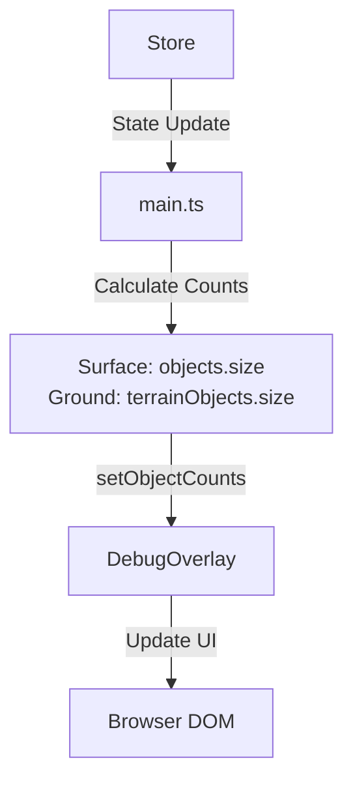

# Work Summary

Updated the Debug Overlay to differentiate between Surface objects (bots, items) and Ground objects (terrain). This addresses a bug where terrain objects were missing from the total object count, providing a more accurate view of the game state complexity.

Key achievements:

- **Dual Object Counting**: Split object tracking into Surface and Ground categories.
- **UI Update**: Debug overlay now shows `Objects: X (Surf) / Y (Gnd)`.
- **Bug Fix**: Resolved the issue where object count was reported as inaccurate/missing terrain.

## Commit Reference

- **Commit**: `91c751c150a11bed9ef774364698ec255bccd8d2`
- **GitHub**: https://github.com/masyl/outside/commit/91c751c150a11bed9ef774364698ec255bccd8d2
- **Description**: Update debug overlay to show split counts for surface and ground objects

---

# Show Ground and Surface Object Counts

This plan addresses the task of showing both Ground objects (terrain) and Surface objects (bots, etc.) in the Debug Overlay. Currently, only surface objects are counted.

### 1. Modify Debug Overlay

Updated `[packages/outside-client/src/debug/overlay.ts](packages/outside-client/src/debug/overlay.ts)` to:

- Rename `setObjectCount` to `setObjectCounts(surface: number, ground: number)`.
- Update the display text to show both counts, e.g., `Objects: {surface} (Surf) / {ground} (Gnd)`.
- Update internal state variables if needed.

### 2. Update Main Application

Updated `[packages/outside-client/src/main.ts](packages/outside-client/src/main.ts)` to:

- Calculate both surface object count (`world.objects.size`) and ground object count (`world.groundLayer.terrainObjects.size`).
- Call the updated `setObjectCounts` method with both values.

### 3. Verification

- Verify that the overlay displays both counts correctly.
- Mark the task as done in `packages/outside-client/agent-collab/testing.md`.

### Mermaid Diagram

