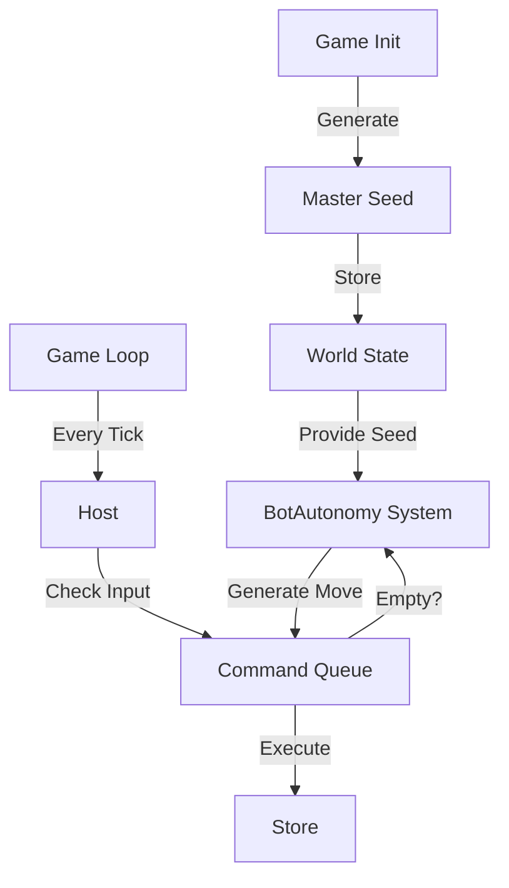

# Work Summary

Implemented basic autonomous behavior for bots, allowing them to move randomly without player input. This system is deterministic, powered by a seeded random number generator (LCG) derived from a persistent master seed in the world state.

Key achievements:

- **Bot Autonomy**: Bots now randomly decide to move (up/down/left/right) or wait each turn.
- **Seeded Randomness**: Implemented a `Random` utility class using an LCG algorithm. The master seed is stored in `WorldState` and persisted/restored with game saves.
- **Legacy Support**: Added logic to auto-generate seeds for old save states that lacked them.
- **Stability Fixes**: Fixed a crash related to command queue sizing and reduced console log spam.

## Commit Reference

- **Commit**: `e8aa66dc841738a1bae17f086650633c1bbced8a`
- **GitHub**: https://github.com/masyl/outside/commit/e8aa66dc841738a1bae17f086650633c1bbced8a
- **Description**: feat: implement bot autonomy and reconnection stability (plus log fixes)

---

# Bot Autonomy Implementation

This plan implements basic autonomous behavior for bots as described in the pitch. Bots will make random movement decisions during each game step if no player command overrides them.

### 1. Game Loop Independence

Ensured the game loop progresses automatically even without user input.

- Validated that `HostMode` drives the simulation with a `startStepCounter` interval (125ms).

### 2. Master Seed & PRNG

Implemented a seeded PRNG and stored the master seed in the game state.

- Updated `WorldState` in `[packages/outside-core/src/types.ts](packages/outside-core/src/types.ts)` to include a `seed: number`.
- Updated `createWorldState` to generate a random master seed.
- Created `[packages/outside-client/src/game/random.ts](packages/outside-client/src/game/random.ts)` with a `Random` class (LCG).

### 3. Autonomous Bot Logic

Created a new system for handling bot autonomy.

- Created `[packages/outside-client/src/game/autonomy.ts](packages/outside-client/src/game/autonomy.ts)`.
- Implemented `BotAutonomy` class:
  - `decideAction(bot: GameObject, world: WorldState): Command | null`
  - Logic: 1/6 chance to wait, otherwise random direction.

### 4. Integration with Host

Integrated the autonomy system into the `HostMode`.

- In `[packages/outside-client/src/network/host.ts](packages/outside-client/src/network/host.ts)`:
  - Initialized `BotAutonomy` using the world's master seed.
  - Inside the step loop, iterates through bots and enqueues autonomous commands if the queue isn't backed up.

### 5. Conflict Resolution

Basic conflict resolution:

- Autonomy only issues commands if the command queue is not "backed up" (simple heuristic: length > bots \* 2).
- Player commands share the same queue.

### Mermaid Diagram

