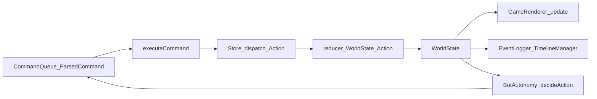

# Technical Recommendation: Entity-Component-System (ECS) Pattern in TypeScript

**Date:** January 24, 2026  
**Status:** Recommendation  
**Scope:** Game core architecture  

---

## 1. Executive Summary

This document recommends adopting an **Entity-Component-System (ECS)** architecture for the game simulation layer, implemented in TypeScript. The ECS pattern is ideal for managing multiple entity types (Terrain, Bots) with shared and divergent behaviors, while maintaining data-driven design and performance at scale.

**Current state (as implemented today):** The canonical simulation state is `WorldState`, mutated via `Action` + `reducer(...)` in the client store, and rendered by the Pixi renderer. Sprites are renderer-owned, not part of simulation state.

**Benefits:**
- Composition over inheritance (avoid rigid class hierarchies)
- Cache-friendly, high-performance data iteration
- Easy to extend: add new component types or systems without modifying existing code
- Deterministic simulation (supports features like replays, rewinding, and networking)
- Clear separation between data (components) and behavior (systems)

---

## 1.1 Architecture Snapshot (Current Implementation)

Before proposing ECS, it’s important to anchor this recommendation in the current codebase.

### Simulation + Rendering pipeline (today)

- **Simulation state of record**: `WorldState` ([`packages/outside-core/src/types.ts`](../outside-core/src/types.ts))
- **State transitions**: `Action` + `reducer(state, action)` ([`packages/outside-client/src/store/actions.ts`](../outside-client/src/store/actions.ts), [`packages/outside-client/src/store/reducers.ts`](../outside-client/src/store/reducers.ts))
- **Execution loop**: `GameLoop` processes queued commands and dispatches actions ([`packages/outside-client/src/game/loop.ts`](../outside-client/src/game/loop.ts))
- **Autonomy / AI**: decisions are produced as commands, not state mutations ([`packages/outside-client/src/game/autonomy.ts`](../outside-client/src/game/autonomy.ts))
- **Rendering**: Pixi sprites and textures are owned by `GameRenderer` / layer helpers ([`packages/outside-client/src/renderer/renderer.ts`](../outside-client/src/renderer/renderer.ts), [`packages/outside-client/src/renderer/objects.ts`](../outside-client/src/renderer/objects.ts), [`packages/outside-client/src/renderer/terrain.ts`](../outside-client/src/renderer/terrain.ts))
- **Replay / time travel**: `TimelineManager` reconstructs state by replaying actions into the reducer ([`packages/outside-client/src/timeline/manager.ts`](../outside-client/src/timeline/manager.ts))



### Implication for ECS

To preserve determinism, replay, and time travel, the first ECS transition step should be ECS-style “systems” that **emit `Action`s (or Commands)**, instead of directly mutating component stores.

---

## 2. Architecture Overview

The ECS pattern consists of three core concepts:

### 2.1 Entities

An **entity** is a unique identifier that represents a game object (Terrain tile, Bot, etc.). Entities have no behavior; they are pure IDs that group components together.

```ts
export type EntityId = string;
```

In your system:
- **Bots** are keyed by `id` in `world.objects: Map<string, GameObject>`
- **Terrain** is keyed by `id` in `world.groundLayer.terrainObjects: Map<string, TerrainObject>`
- IDs are already stable, serializable, and timeline-friendly

### 2.2 Components

A **component** is a data container holding state for one aspect of an entity. Components have **no methods** and no behavior—only fields.

**Important note (current implementation):** The simulation does **not** have a `Sprite` component. Sprites are renderer-side (Pixi textures/sprites, `spriteIndex`), not part of `WorldState`.

**Current simulation data you can treat as “components”:**

```ts
export interface Position {
  x: number;
  y: number;
}
```

Examples of current “component-ish” data in `WorldState`:

- **Bot tag**: `GameObject.type === 'bot'`
- **Bot position**: `GameObject.position?: Position` (optional until placed)
- **Terrain rectangle**: `TerrainObject.position + width + height`
- **Terrain type**: `TerrainObject.type` (`'grass' | 'dirt' | 'water' | 'sand' | 'hole'`)
- **Walkability**: derived from terrain (`isWalkable(...)` in `packages/outside-core/src/world.ts`)
- **Occupancy**: `world.grid` acts as an index of top-layer occupancy (treat as derived/indexed state during transition)

**Future components (not currently represented in `WorldState`)**:

```ts
// For Bots only
export interface Velocity {
  vx: number;
  vy: number;
}

export interface BotController {
  state: "idle" | "randomWalk";
}

// For Terrain only
export interface TerrainType {
  tileType: "grass" | "dirt" | "water" | "sand" | "hole";
  // Phase 1: passable/walkable can remain derived from tileType in WorldState-first phase.
  // Phase 2: you may choose to store them explicitly for faster queries.
  passable?: boolean;
  walkable?: boolean;
}
```

### 2.3 Systems

A **system** is a unit of logic that:
1. Queries the World for entities with a specific set of components
2. Iterates over those entities
3. Reads/writes component data

Systems have **minimal state** and **no per-entity methods**.

**Adaptation for this codebase:** State changes flow through `Action` → `reducer(WorldState, Action)` and are recorded for replay/time-travel. Therefore the first ECS step should model systems as **pure functions that emit Actions (or Commands)**, instead of mutating component stores directly.

**Proposed ECS-style system shape (Phase 1):**

```ts
export interface SimulationSystem {
  readonly name: string;
  step(input: { dt: number }, world: WorldState): Action[];
}

// Example: autonomy system emits MOVE_OBJECT actions (reducer applies rules)
export class AutonomySystem implements SimulationSystem {
  readonly name = "autonomy";

  constructor(private autonomy: BotAutonomy) {}

  step(input: { dt: number }, world: WorldState): Action[] {
    const out: Action[] = [];
    for (const obj of world.objects.values()) {
      if (obj.type !== "bot") continue;
      const cmd = this.autonomy.decideAction(obj, world);
      if (!cmd) continue;
      if (cmd.type === "move") {
        out.push(actions.moveObject(cmd.id, cmd.direction, cmd.distance));
      }
    }
    return out;
  }
}
```

### 2.4 World (ECS Manager)

In this codebase, the “World” concept already exists as `WorldState`.

For an incremental transition, treat ECS as **a set of systems over `WorldState` that emit `Action`s**, rather than immediately replacing the store/reducer with component stores.

#### Phase 1: `WorldState` as source-of-truth + system queries + emitted Actions (recommended)

This preserves:
- determinism
- replay/time travel (`TimelineManager`)
- existing reducer-based validation and invariants

```ts
export function queryBots(world: WorldState): GameObject[] {
  return Array.from(world.objects.values()).filter((o) => o.type === "bot");
}

export interface SimulationSystem {
  readonly name: string;
  step(input: { dt: number }, world: WorldState): Action[];
}
```

#### Phase 2: ECS storage (optional later)

Once Phase 1 is stable and profiling suggests it’s worth it, introduce component stores (Map or SoA) keyed by existing string IDs. Keep `WorldState` as the serialization format until you intentionally switch sources of truth.

---

## 3. Usage Examples

### 3.1 Creating Terrain + Bots (current approach via Actions)

```ts
store.dispatch(actions.createTerrain("ground", "grass", 0, 0, 20, 10));
store.dispatch(actions.createBot("bot-1"));
store.dispatch(actions.placeObject("bot-1", { x: 1, y: 1 }));
```

### 3.2 ECS-style system emitting Actions (recommended transition step)

```ts
for (const action of autonomySystem.step({ dt }, store.getState())) {
  store.dispatch(action);
}
```

### 3.3 Game Loop Integration

```ts
// The game loop already exists and dispatches Actions; Phase 1 systems plug into it.
// This preserves EventLogger + TimelineManager behavior because the history unit stays Action-based.
```

---

## 4. Design Rules and Best Practices

### 4.1 Component Design

**Do:**
- Keep components as **data only** (fields, no methods)
- Use primitives or simple data structures (numbers, strings, arrays)
- Name components by the aspect they represent (`Position`, `Velocity`, `BotController`)
- Make components reusable across multiple entity types

**Don't:**
- Add behavior or methods to components
- Store references to systems or other framework code in components
- Create "kitchen-sink" components; split unrelated data into separate components
- Use inheritance or polymorphism within components

### 4.2 System Design

**Do:**
- Make systems small and focused (one responsibility per system)
- Use the query interface to get entities with required components
- Keep the inner loop tight (minimal branching, no allocations)
- Order systems logically (e.g., input -> AI -> movement -> collision -> rendering)

**Don't:**
- Add state that couples systems to specific entity types
- Create complex inter-system dependencies; use a message/event queue if needed
- Call UI or framework code directly from systems; emit events instead
- Use closures or per-frame allocations in hot loops

### 4.3 Adding New Components

When you want to add a new aspect (e.g., "Bots have inventory"):

1. **Define the component:** Create an interface/class with only data fields
2. **Create a system** (if needed) to process it
3. **Compose entities** with the new component

**Note:** The example below shows a classic “component-store ECS” API (Phase 2). In Phase 1 (WorldState-first), you would store inventory data in `WorldState` and have an `InventorySystem` emit Actions that the reducer applies.

Example:

```ts
export interface Inventory {
  items: { name: string; count: number }[];
  maxSlots: number;
}

export class InventorySystem implements System {
  readonly name = "inventory";
  update(world: World, dt: number): void {
    const entities = world.query([Inventory]);
    // Logic to manage item pickup, dropping, etc.
  }
}

// Then add to a bot:
world.addComponent(bot, Inventory, {
  items: [],
  maxSlots: 10,
});
world.addSystem(new InventorySystem());
```

### 4.4 Adding New Systems

When you want to add new behavior (e.g., "collision detection"):

1. **Identify the components** it needs to operate on
2. **Implement the System interface** with an `update(world, dt)` method
3. **Register it with the World**

**Note:** The example below is Phase 2-style (component-store ECS). In Phase 1, collision logic should emit Actions/“events” (or set derived fields) and keep the reducer as the authoritative place that applies changes to `WorldState`.

Example:

```ts
export class CollisionSystem implements System {
  readonly name = "collision";

  update(world: World, dt: number): void {
    const entities = world.query([Position]); // e.g., damageable entities
    
    // Check collisions between entities
    for (let i = 0; i < entities.length; i++) {
      for (let j = i + 1; j < entities.length; j++) {
        const e1 = entities[i];
        const e2 = entities[j];
        
        const pos1 = world.getComponent(e1, Position);
        const pos2 = world.getComponent(e2, Position);
        
        if (this.checkCollision(pos1, pos2)) {
          // Handle collision
        }
      }
    }
  }

  private checkCollision(pos1: Position, pos2: Position): boolean {
    // Simple circle collision or AABB
    const dx = pos1.x - pos2.x;
    const dy = pos1.y - pos2.y;
    return Math.sqrt(dx * dx + dy * dy) < 32; // arbitrary radius
  }
}

world.addSystem(new CollisionSystem());
```

---

## 5. Performance Considerations

### 5.1 Data Layout (Immediate)

For Phase 2 (component-store ECS), storing components in `Map<EntityId, Component>` is fine and simple. This works well for hundreds or even thousands of entities in browser JavaScript.

```ts
// Current: Map-based (simple, adequate for most cases)
const componentStores = new Map<Function, Map<EntityId, unknown>>();
```

### 5.2 Data Layout (Future Optimization)

If you need to handle thousands of entities, migrate hot components (Position, Velocity) to **structure-of-arrays** (SoA) using typed arrays:

```ts
// Future: SoA with Float32Array (for Position)
export class PositionStore {
  private xs = new Float32Array(1000);
  private ys = new Float32Array(1000);
  private indices = new Map<EntityId, number>();

  set(entity: EntityId, x: number, y: number): void {
    if (!this.indices.has(entity)) {
      const idx = this.indices.size;
      this.indices.set(entity, idx);
    }
    const idx = this.indices.get(entity)!;
    this.xs[idx] = x;
    this.ys[idx] = y;
  }

  get(entity: EntityId): { x: number; y: number } {
    const idx = this.indices.get(entity)!;
    return { x: this.xs[idx], y: this.ys[idx] };
  }

  *iterateAll(): Generator<[EntityId, number, number]> {
    for (const [entity, idx] of this.indices) {
      yield [entity, this.xs[idx], this.ys[idx]];
    }
  }
}
```

This can be introduced **incrementally** once profiling shows it's needed.

### 5.3 Query Optimization

For many systems querying the same components repeatedly, cache the query result:

```ts
export class RenderSystem implements System {
  private cachedEntities: EntityId[] = [];
  
  update(world: World, dt: number): void {
    this.cachedEntities = world.query([Position, SpriteSpec]);
    
    for (const entity of this.cachedEntities) {
      // ...
    }
  }
}
```

---

## 6. Integration with Pixi.js

This separation already exists today:

- Simulation produces `WorldState`
- Rendering is handled by `GameRenderer.update(world)` and per-layer helpers
- Pixi sprites/textures live in the renderer (e.g. `spriteIndex: Map<string, Sprite>`)

References:
- [`packages/outside-client/src/renderer/renderer.ts`](../outside-client/src/renderer/renderer.ts)
- [`packages/outside-client/src/renderer/objects.ts`](../outside-client/src/renderer/objects.ts)
- [`packages/outside-client/src/renderer/terrain.ts`](../outside-client/src/renderer/terrain.ts)

### 6.1 Rendering Simplification: One Render Component + One Render System

Today, terrain and bots are rendered through *separate* pipelines:

- Terrain: `createTerrainLayer(...)` / `updateTerrainLayer(...)`
- Bots: `createObjectsLayerWithIndex(...)` / `updateObjectsLayerWithIndex(...)`

As we transition toward ECS, the renderer can be simplified by introducing **one shared renderer-side “renderable” component shape** for *both* bots and terrains, and a **single RenderSystem** that iterates and renders all renderables.

#### Key idea

Normalize different simulation structures (bots in `world.objects`, terrains in `world.groundLayer.terrainObjects`) into a single stream of renderables:

```ts
export type RenderKind = "terrain" | "bot";

export interface Renderable {
  id: string; // stable EntityId
  kind: RenderKind;
  position: Position; // grid position (top-left for terrain rects)
  sprite: SpriteSpec; // renderer-owned "what to draw"
  z: number; // derived draw order (terrain < bots), or use Pixi zIndex

  // Optional: size for terrain rectangles / tiling sprites
  size?: { width: number; height: number };
}
```

Then a single `RenderSystem` can:
- create (or reuse) a Pixi `DisplayObject` per `Renderable.id`
- update its position/appearance from the `Renderable`
- remove display objects when renderables disappear

#### Why this simplifies things

- **One cache/index**: a single `displayIndex: Map<EntityId, DisplayObject>` replaces multiple indices per layer.
- **One update loop**: consistent handling for “create / update / delete” for all visual entities.
- **One place for rendering rules**: selection outlines, hover/debug visuals, and z-ordering become uniform.
- **Easier to add new renderables**: new simulation features only need to produce `Renderable` entries; rendering doesn’t need a new bespoke layer pipeline.

#### How it fits the phased ECS transition

- **Phase 1 (WorldState-first):** build the `Renderable[]` list as a derived view from `WorldState` each frame (or incrementally via cached indices).
- **Phase 2 (component-store ECS):** `Renderable` becomes an actual component composition (`Position` + `SpriteSpec` + `RenderableKind`) and `RenderSystem` queries them directly.

In both phases, the key win is the same: **terrain and bots become “the same kind of thing” to the renderer**, driven by shared components and a single system.

### 6.2 Transition Plan (Parallel Pipeline, Late Swap)

This transition can be executed without breaking the current renderer by building the unified renderer **in parallel**, validating parity, and only swapping the default near the end.

#### Phase 0: Add the new data model (no rendering behavior changes)
- Introduce renderer-side types: `Renderable`, `RenderKind`, `SpriteSpec`
- Add a pure builder: `buildRenderables(world: WorldState): Renderable[]`
- No integration yet; no visual changes

#### Phase 1: Implement the unified renderer (still unused by default)
- Implement a `UnifiedRenderSystem` (or `UnifiedRenderer`) that:
  - consumes `Renderable[]`
  - owns `displayIndex: Map<EntityId, DisplayObject>`
  - handles create/update/delete and ordering
- Keep existing `terrain.ts` + `objects.ts` pipeline untouched

#### Phase 2: Wire it into `GameRenderer` behind a feature flag
- Add a runtime mode like:
  - `rendererMode = "legacy" | "unified" | "dual"`
- Mount two root containers:
  - `legacyRoot` uses the current pipeline
  - `unifiedRoot` uses the new pipeline

#### Phase 3: Run “dual mode” (shadow rendering) to prove parity
- In `"dual"` mode:
  - update both renderers every frame
  - keep **legacy visible**
  - keep **unified invisible** (but running)
- Add lightweight debug parity checks (debug-only):
  - object counts (bots/terrain display objects)
  - per-entity position parity (within tolerance)
  - lifecycle parity (create/remove behavior, no leaks)

#### Phase 4: Late swap (flip the default, keep rollback)
- Switch default from `"legacy"` to `"unified"`
- Keep `"dual"` and `"legacy"` modes available for fast rollback/diagnosis
- Let this bake while monitoring parity/debug metrics

#### Phase 5: Remove legacy (after the swap has proven stable)
- Delete the legacy pipeline code (`terrain.ts`/`objects.ts` update paths) only after:
  - unified mode is default and stable
  - rollback hasn’t been needed for a reasonable period
- Remove the feature flag once the legacy implementation is gone

**Result:** most implementation work happens without risk to the current visuals, and the swap is a small, controlled change late in the process.

### 6.3 Open Questions / Missing Decisions (to make this actionable)

The sections above describe *what* we want to build. To make the transition implementable (and keep the “late swap” safe), we need to explicitly decide the following:

#### Renderable extraction (WorldState -> Renderable[])

- **Terrain granularity**: produce one `Renderable` per `TerrainObject` rectangle (recommended) vs per-tile renderables
- **Stacking / ordering**: define how `TerrainObject.createdAt` maps to `Renderable.z` (stable ordering)
- **Coordinate contract**: `Renderable.position` is grid space; unified renderer owns grid->display conversion (zoom, offsets)

#### Asset resolution & caching

- Define how `SpriteSpec.textureKey` maps to:
  - texture loading (Assets cache)
  - spritesheet slicing (bots/terrain)
  - tiling sprites for terrain rectangles
  - placeholder fallbacks when textures aren’t available

#### DisplayObject lifecycle

- Define create/update/delete rules for the unified `displayIndex`
- Define destruction policy (when to `destroy()` vs reuse) to prevent leaks during dual mode

#### Interaction / picking

- How selection/hover/debug overlays are applied in the unified pipeline (bots + terrain)
- Whether hit-testing uses Pixi events per DisplayObject, or a higher-level picking system

#### Parity gates (dual mode)

- What counts as “parity” for the late swap:
  - display object counts
  - per-entity position tolerance under zoom
  - z-order/stacking expectations
  - memory growth limits over time

**Tracking:** todos + success criteria for these decisions live in [`roadmap.md`](./roadmap.md).

---

## 7. Comparison: ECS vs OOP (before/after)

### Before: OOP Approach (Problematic)

```ts
// Rigid hierarchy
abstract class GameObject {
  x: number;
  y: number;
  sprite: string;
  abstract update(dt: number): void;
}

class Terrain extends GameObject {
  tileType: string;
  update(dt: number) {
    // Terrain rarely moves, but still has update overhead
  }
}

class Bot extends GameObject {
  vx: number;
  vy: number;
  aiState: string;

  update(dt: number) {
    this.x += this.vx * dt;
    this.y += this.vy * dt;
    // AI logic, collision, etc.
  }
}

// Problem: Adding a new aspect (inventory) requires modifying Bot class
// Problem: Different entity types have different update costs
// Problem: Hard to share behavior between unrelated types
```

### After: ECS Approach (Clean, Composable)

```ts
// No class hierarchy. Entities are just IDs.
// Components are pure data.
// Systems handle behavior independently.
// NOTE: This block illustrates Phase 2 (component-store ECS). In Phase 1, the same
// “composition” idea applies, but state-of-record remains WorldState + Actions.

const terrain = world.createEntity();
world.addComponent(terrain, Position, { x: 0, y: 0 });
// NOTE: rendering data (sprites/textures) is renderer-owned in the current codebase.
world.addComponent(terrain, SpriteSpec, { textureKey: "grass" });
world.addComponent(terrain, TerrainType, { tileType: "grass", passable: true });

const bot = world.createEntity();
world.addComponent(bot, Position, { x: 100, y: 100 });
world.addComponent(bot, SpriteSpec, { textureKey: "bot" });
world.addComponent(bot, Velocity, { vx: 0, vy: 0 });
world.addComponent(bot, Health, { current: 100, max: 100 });
world.addComponent(bot, BotController, { state: "idle" });

// Add new components/systems without touching existing code
world.addComponent(bot, Inventory, { items: [], maxSlots: 10 });
world.addSystem(new InventorySystem());

// Each system is focused and reusable
world.addSystem(new MovementSystem());
world.addSystem(new BotSystem());
world.addSystem(new RenderSystem());
```

---

## 8. Roadmap, Todos, and Success Criteria

The detailed implementation roadmap (todos + success criteria) has been moved to keep this recommendation focused on architecture and rationale:

- [`roadmap.md`](./roadmap.md)

---

## 9. References

- [Maxwell Forbes: Building an ECS in TypeScript](https://maxwellforbes.com/posts/typescript-ecs-what/)
- [Pixi.js + ECS Integration Example](https://github.com/bendiksolheim/ecs)
- [Data-Oriented Design in Game Engines](https://nttdata-dach.github.io/posts/sh-dataorienteddesignecs/)

---

## 10. Decision Record

**Decision (proposed):** Transition toward ECS via ECS-style systems that emit Actions (keep reducer as source-of-truth initially)  
**Reasoning:**
- Scales better than OOP GameObject hierarchies
- Separates data from behavior (easier testing, debugging, replays)
- Composition enables flexible entity building
- Preserves determinism + replay/time travel by keeping Actions as the history unit

**Trade-offs:**
- Some duplication during transition (rules live in reducer while systems mature)
- Requires discipline: keep systems focused and avoid renderer/UI coupling
- A full ECS storage rewrite is deferred until it’s clearly beneficial

**Status:** RECOMMENDED (incremental adoption)

---

## Appendix: TypeScript Type Definitions

```ts
// Core ECS types
export type EntityId = string;

export interface Component {
  // Marker interface; components are pure data
}

export interface SimulationSystem {
  readonly name: string;
  step(input: { dt: number }, world: WorldState): Action[];
}

// In this codebase, WorldState is the simulation source-of-truth today.
// A component-store World can be introduced later if needed.

// Game-specific components
export interface Position {
  x: number;
  y: number;
}

// Rendering data (sprites/textures) is renderer-owned in the current architecture.
// Avoid moving Pixi objects into simulation components.
export interface SpriteSpec {
  textureKey: string;
}

export interface Velocity {
  vx: number;
  vy: number;
}

export interface BotController {
  state: "idle" | "randomWalk";
}

export interface TerrainType {
  // Phase 1: derive from tileType in WorldState-first phase.
  // Phase 2: store explicitly if useful.
  passable?: boolean;
  walkable?: boolean;
  tileType: "grass" | "dirt" | "water" | "sand" | "hole";
}
```
